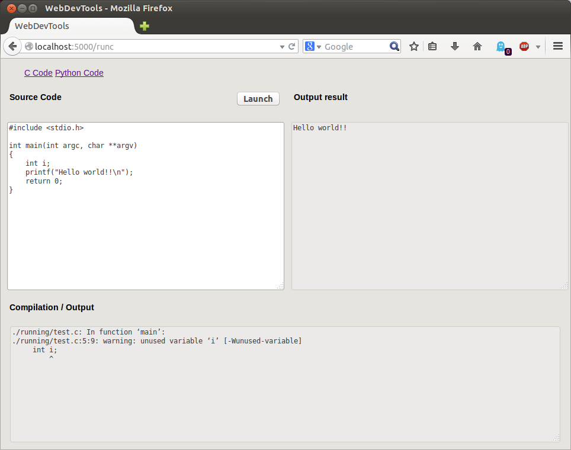

codelauncher
============

A Flask Python server to launch C code and Python code online.

This is a simple, light Flask server that allows you to quickly run C code or Python code.
It uses only HTML5 and CSS3. No Javascript is needed but if activated the `Ace editor <http://ace.c9.io>`_ is available.

The only dependency is Flask.

Below you have screenshots_.

This software is made for you if you are looking for:

- something simple to write basic code
- something unified to run C and Python basic programs from source code (switching using one clic)
- not creating a file, compiling, using a terminal neither using an interpreter
- having a quick result using one clic on a button
- no advertising and open source tool
- using a web browser
- working in localhost
- not needing javascript (unless needing a more efficient code editor)
- customizable
- not security constraints

**WARNING: Be careful, this is intended to run in local as there is no sandbox, no security management.**

How to use
----------

The easy way is to clone it and use it via a virtualenv:

.. code-block:: sh

    $ git clone https://github.com/dadadel/codelauncher.git  # or git@github.com:dadadel/codelauncher.git
    $ cd codelauncher

    $ virtualenv env
    $ . env/bin/activate
    $ pip install Flask

Run the server:

.. code-block:: sh

    $ python webdev.py

Then visite with your web browser the URL: `http://127.0.0.1:5000`.

.. _screenshots:

Screenshot
----------

- Ace editor is used when Javascript is activated:

- When no Javascript activated, basic text box:

